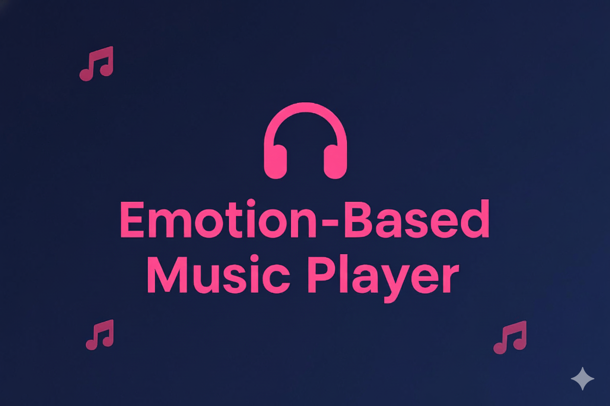
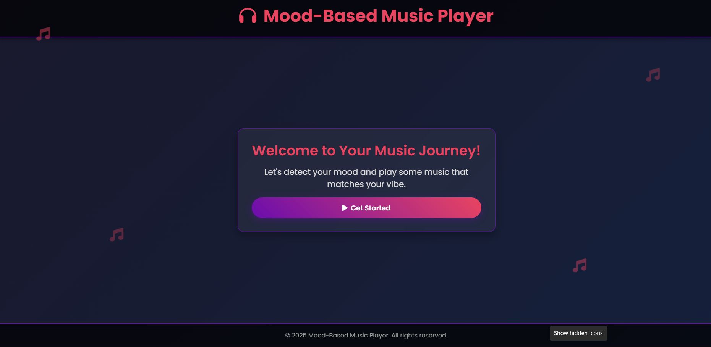
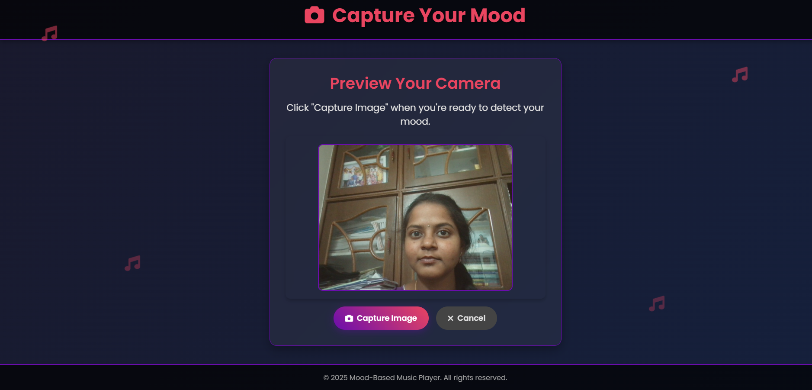
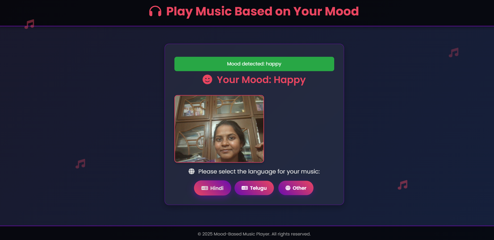
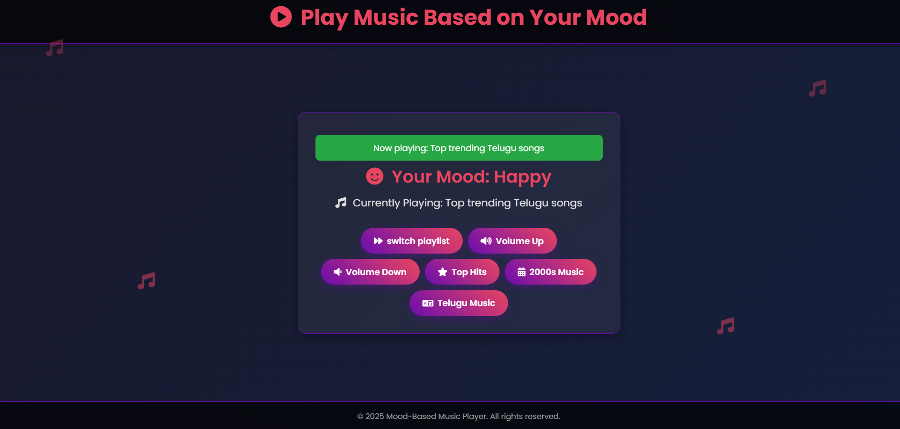
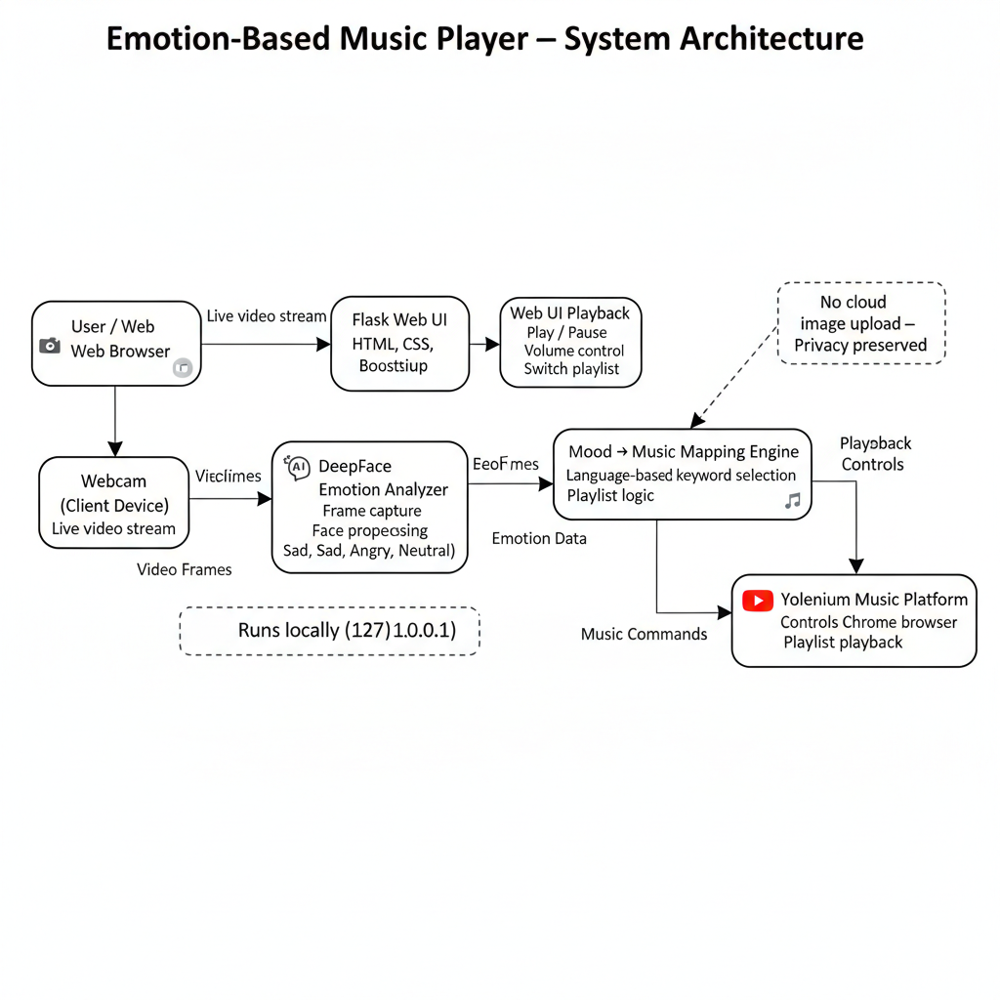

<p align="center">
  
</p>

# Emotion-Based Music Player
<p align="center">
  
  
  
  
</p>

An AI-powered web app that analyzes your facial expression, detects your mood, and automatically plays a personalized music playlist on YouTube Music.

---

## 📑 Table of Contents
- [⚡ Quick Start](#quick-start)
- [💡 About the Project](#about-the-project)
- [🎥 Demo & Screenshots](#demo--screenshots)
- [✨ Features](#features)
- [� Tech Stack](#-tech-stack)
- [🧠 System Architecture](#system-architecture)
- [� Installation](#installation)
- [Usage](#usage)
- [� Results](#results)
- [Project Structure](#project-structure)
- [Troubleshooting](#troubleshooting)
- [� Future Enhancements](#future-enhancements)
- [🤝 Contributing](#contributing)
- [🙏 Acknowledgements](#acknowledgements)
- [📜 License](#license)
- [Author](#author)

## ⚡ Quick Start

```bash
git clone <your-repo-url>
cd MOOD_MUSIC_PLAYER
pip install -r requirements.txt
python main.py
```

Then open 👉 http://127.0.0.1:5000

<p align="right">(<a href="#emotion-based-music-player">⬆ Back to top</a>)</p>

---

## 💡 About the Project
The Mood-Based Music Player is designed to create a seamless connection between your emotional state and your music. Instead of manually searching for songs that match your vibe, this app uses your webcam to perform real-time mood analysis and curates a listening experience just for you.

This project leverages computer vision for emotion detection and web automation for music playback, offering a unique and interactive way to discover and enjoy music.

It supports:
Real-time mood detection from a live camera feed.
Multi-language music recommendations (Hindi, Telugu, Other).
Automated browser control for a hands-free experience.
A clean, interactive frontend built with Flask and Bootstrap.

## 🎥 Demo & Screenshots

Below are side-by-side GIF previews and static screenshots for each key view.

<table>
  <thead>
    <tr>
      <th align="left">View</th>
      <th align="left">GIF Preview</th>
      <th align="left">Screenshot</th>
    </tr>
  </thead>
  <tbody>
    <tr>
      <td><b>Welcome Page</b></td>
      <td></td>
      <td></td>
    </tr>
    <tr>
      <td><b>Live Camera Capture</b></td>
      <td></td>
      <td></td>
    </tr>
    <tr>
      <td><b>Mood Detection Result</b></td>
      <td></td>
      <td></td>
    </tr>
    <tr>
      <td><b>Music Playback</b></td>
      <td></td>
      <td></td>
    </tr>
  </tbody>
  </table>

<p align="right">(<a href="#emotion-based-music-player">⬆ Back to top</a>)</p>

## ✨ Features

### 🖥️ Frontend
- Modern, responsive UI built with HTML, CSS, and Bootstrap 5.
- Themed design with animated music notes, a waveform background, and smooth fade-in effects.
- Live camera preview stream directly on the capture page.
- Clear user flow: Welcome → Capture → Select Language → Playback.
- Interactive playback controls for switching playlists and adjusting volume.
- Interactive UX elements: copy-to-clipboard buttons, thinking/loading spinners, auto-closing modals
- User feedback via flashed messages for success and error states.
- Mobile-friendly layout for a consistent experience on all devices.

### ⚙️ Backend
- Flask server for handling web requests and application logic.
- Real-time video streaming using OpenCV.
- Mood analysis powered by the DeepFace library for accurate emotion recognition.
- Selenium and webdriver-manager for robust, automated browser control of YouTube Music.
- Dynamic music recommendation engine with mood-to-query mapping for multiple languages.
- Structured project with separate templates for each step of the user journey.
- Graceful cleanup of camera and WebDriver resources on application exit.

### 🔒 Privacy & Security
- All image processing is done locally. No images are uploaded to external servers.
- The application runs entirely on your local machine (127.0.0.1).
- Camera access is only active on the capture page and is released immediately after use.

---

## 🛠 Tech Stack

**Frontend**
- HTML, CSS, Bootstrap 5
- Font Awesome (CDN) for icons
- Jinja2 Templating (via Flask)

**Backend**
- Python 3.7+
- Flask (Web Framework)
- OpenCV-Python (Camera & Image Handling)
- DeepFace (Emotion Detection)
- Selenium (Browser Automation)
- webdriver-manager (Automated ChromeDriver setup)

---

## 🧠 System Architecture



### Workflow
1. User opens the web application
2. Webcam captures facial image
3. OpenCV processes the frame
4. DeepFace detects emotion
5. Emotion is mapped to music keywords
6. Selenium automates YouTube Music playback
7. User controls playback via web UI

<p align="right">(<a href="#emotion-based-music-player">⬆ Back to top</a>)</p>

## 📦 Installation

1. **Clone the repository**
   ```bash
   git clone <your-repo-url>
   cd <repository-folder-name>
   ```
2. **Create and activate a virtual environment (recommended)**
   ```bash
   # For Windows
   python -m venv venv
   venv\Scripts\activate

   # For macOS/Linux
   python3 -m venv venv
   source venv/bin/activate
   ```
3. **Install dependencies:**
   ```bash
   pip install -r requirements.txt
   ```
4. **Run the application**
   ```bash
   python main.py
   ```

<p align="right">(<a href="#emotion-based-music-player">⬆ Back to top</a>)</p>

---
## Usage
1. Click Get Started on the welcome page.
2. Allow the browser to access your camera when prompted.
3. Position your face in the frame and click Capture Image.
4. The app will analyze your mood and display the result.
5. On the next screen, select a preferred language for your music (Hindi, Telugu, or Other).
6. A new browser window will open automatically and start playing a playlist from YouTube Music that matches your mood and language choice.
7. Use the controls on the web app page to switch playlist, adjust Volume Up/Down, or play Top Hits.

<p align="right">(<a href="#emotion-based-music-player">⬆ Back to top</a>)</p>

## 📊 Results

- Successfully detects emotions such as Happy, Sad, Angry, Neutral
- Real-time camera-based emotion analysis
- Accurate mood-to-music mapping
- Smooth hands-free music playback experience
- Works consistently across multiple lighting conditions

<p align="right">(<a href="#emotion-based-music-player">⬆ Back to top</a>)</p>

## Project Structure
```
MOOD_MUSIC_PLAYER/
├── static/
│   ├── captured_image.jpg       # Stores the last captured image
│   └── styles.css               # Custom styling for the frontend
├── templates/
│   ├── capture.html             # Page for camera preview and image capture
│   ├── playback.html            # Page with music controls after detection
│   ├── select_language.html     # Page to choose music language
│   └── welcome.html             # The main landing page
├── main.py                      # Main Flask application logic
└── README.md
```

## Troubleshooting
- If the camera feed doesn't appear: Make sure you have granted camera permissions to your browser for 127.0.0.1:5000. Reloading the page might help.
- If music doesn't play: Ensure you have Google Chrome installed. The Selenium automation is configured for Chrome.
- For DeepFace errors on first run: The library may need to download pre-trained models. Please ensure you have an active internet connection the first time you run the analysis.
- If the app fails to start: Check that all dependencies were installed correctly in your virtual environment.

## 🚀 Future Enhancements

- 🎙️ Voice-controlled music commands
- 📱 Android / iOS mobile application
- 🎧 Spotify integration
- 🧠 Emotion history & analytics dashboard
- 🌐 Multi-user support

<p align="right">(<a href="#emotion-based-music-player">⬆ Back to top</a>)</p>

---

## 🤝 Contributing
Contributions are welcome!  
If you'd like to improve this project, please follow these steps:  
1. Fork the repository  
2. Create a feature branch (`git checkout -b feature-name`)  
3. Commit your changes (`git commit -m 'Add new feature'`)  
4. Push to your branch (`git push origin feature-name`)  
5. Open a Pull Request  

---
## 🙏 Acknowledgements
This project wouldn’t be possible without these amazing tools and libraries:  
- [Flask](https://flask.palletsprojects.com/) – Backend framework  
- [DeepFace](https://github.com/serengil/deepface) – Facial analysis and emotion detection 
- [OpenCV](https://opencv.org/) – Webcam and computer vision tasks 
- [Selenium](https://www.selenium.dev/.) – Web automation 
- [Bootstrap](https://getbootstrap.com/) – Responsive frontend framework 
- [Font Awesome](https://fontawesome.com/) – Icons  

---
## License
MIT

## Author
- Developed by Gudiwada sruthi

